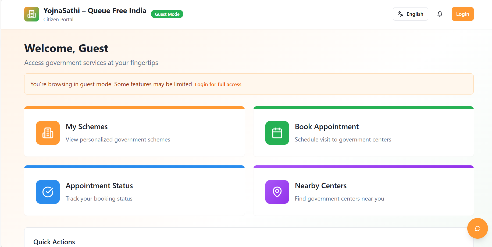
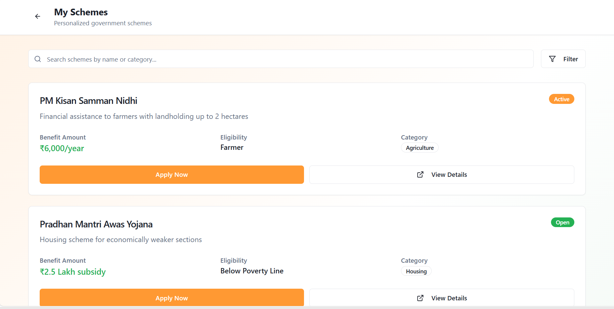
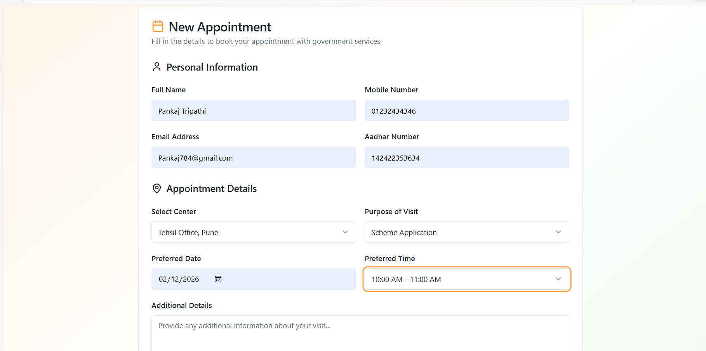
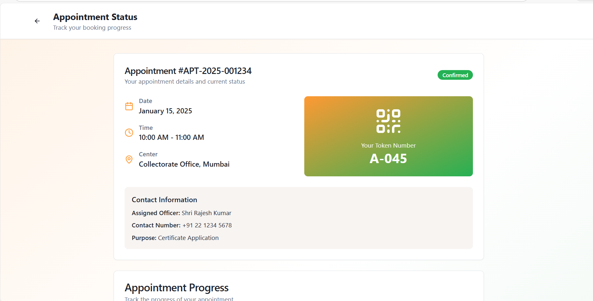

# Yojnasathi - Queue Free India

---

## Problem Statement

In rural India, citizens often face long queues, lack of awareness, and difficulty in filling complex forms to access government schemes at eSeva/CSC centers. Many are not digitally literate, leading to wasted time, repeated visits, and incomplete applications. Additionally, server overloads and absence of appointment systems further increase waiting time and inefficiency.

---

## Why This Project Matters

This project addresses real challenges faced by rural citizens in accessing government services. By digitizing scheme discovery and reducing dependency on physical queues, Yojnasathi aims to improve efficiency, accessibility, and overall user experience.

---

## Project Overview

- Yojnasathi – Queue Free India is a web application designed to streamline access to government services and reduce long queues at eSeva/CSC centers.
- The platform supports mobile OTP-based authentication using Vonage API, along with a Guest Mode, allowing users to explore the application even without login. Once authenticated, users can access multiple service-focused modules:
- My Schemes: Displays government schemes that the user is eligible to apply for based on their profile.
- Book Appointment: Allows users to book appointments at eSeva centers by submitting personal details, selecting preferred date and time, choosing a service center, and viewing the list of required documents based on the purpose of visit.
- Appointment Status: Provides real-time appointment tracking with a unique token (letter + number), center contact information, and a visual progress bar showing the appointment stage.
- Nearby eSeva Centers: Enables users to search for nearby service centers based on their location with Google Maps integration for better navigation and accessibility.

---

## Key Features

- User Authentication with OTP
- Supabase backend integration
- Component-Based Architecture
- Tailwind CSS for Styling
- Performance optimizations

---

## Screenshots

### Home Page


### My Schemes


### Book Appointment


### Appointment Status


### Nearby eSeva/CSC Centers


---

## Tech Stack

- Vite
- React
- TypeScript
- Tailwind CSS
- shadcn-ui

---

## Live Demo

🔗 https://yojnasathi-sih.vercel.app/

⚠️ Note: OTP authentication using Vonage API has been discontinued.
To ensure smooth access, the application currently supports Guest Mode,
allowing users to explore the full UI and scheme flow without login.

---

## Installation & Setup

Follow these steps to run the project locally:
```bash
# Clone the repository
git clone https://github.com/keshavgit23/yojnasathi.git

# Navigate into the project folder
cd yojnasathi-connect-ui

# Install dependencies
npm install

# Start the development server
npm run dev

👉 Make sure you have Node.js and npm installed before running the project.
```
---

## 📂 Project Structure

yojnasathi-connect-ui
│
├── public/        # Static assets
├── src/           # Application source code
├── index.html     # Entry HTML file
├── vite.config.ts # Vite configuration
└── package.json   # Dependencies & scripts

---

## Future Improvements

- Advanced Authentication – Replace discontinued OTP service with providers like Firebase or Twilio for more reliable login.
- User Dashboard – Personalized dashboard to track applied schemes and recommendations.
- Smart Search & Filters – Enable search by category, eligibility, location, and benefits.
- Save / Bookmark Schemes – Allow users to bookmark schemes for quick access later.
- AI-Based Recommendations – Suggest relevant schemes based on user profile and preferences.
- Notifications System – Alerts for new schemes, deadlines, and status updates.


---

## Contributing

Contributions are welcome!
Feel free to fork the repository and submit a pull request.

---

## If you like this project, consider giving it a star!